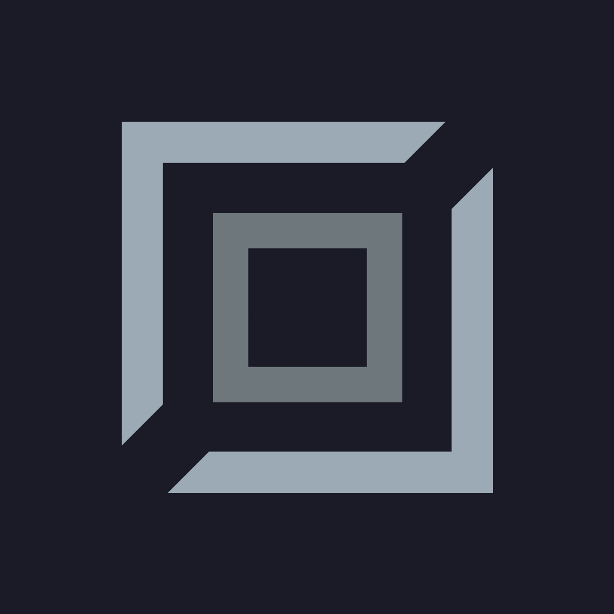
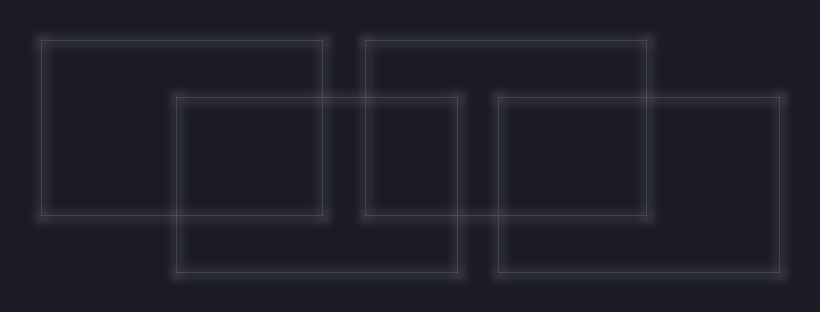

# Ayush Bhattarai (Kaerithen 27)

<div align="center">
<pre style="white-space: nowrap; overflow-x: auto; max-width: 100%;">

```TypeScript
888    d8P                            d8b 888    888                         .d8888b.  8888888888
888   d8P                             Y8P 888    888                        d88P  Y88b       d88P
888  d8P                                  888    888                               888      d88P
888d88K      8888b.   .d88b.  888d888 888 888888 88888b.   .d88b.  88888b.       .d88P     d88P
8888888b        "88b d8P  Y8b 888P"   888 888    888 "88b d8P  Y8b 888 "88b  .od888P"   88888888
888  Y88b   .d888888 88888888 888     888 888    888  888 88888888 888  888 d88P"        d88P
888   Y88b  888  888 Y8b.     888     888 Y88b.  888  888 Y8b.     888  888 888"        d88P
888    Y88b "Y888888  "Y8888  888     888  "Y888 888  888  "Y8888  888  888 888888888  d88P
```

</pre>
</div>

> Learning as I grow, one concept at a time.

## 🪪 Basic Details

<div style="display: flex; align-items: center; gap: 24px; margin: 24px 0;">
  
  <div style="flex: 1;">
    <h1 style="margin: 0; font-size: 28px;">Ayush Bhattarai</h1>
    <p style="margin: 4px 0; color: #64748b;">Pseudonym: Kaerithen27</p>
    <p style="margin: 8px 0;">
      <a href="mailto:ayushbhattarai27@proton.me" style="text-decoration: none; color: #3b82f6;">Email</a> •
      <a href="https://codeberg.org/kaerithen27" target="_blank" style="text-decoration: none; color: #64748b;">Codeberg</a> •
      <a href="https://github.com/kaerithen27/kaerithen27" target="_blank" style="text-decoration: none; color: #64748b;">GitHub</a>
    </p>
  </div>
  
</div>

## 📖 About Me

Systems Architect building production-grade software that endures real-world constraints. I integrate data science for intelligence and security for enforcement, prioritizing structural permanence, coherence, and long-term maintainability over novelty.

## 🛠️ Language & Tools


- **Language:** _Rust_
- **Frontend:** _Leptos_
- **Backend:** _Actix_
- **Database:** _PostgreSQL_ (Docker) _+ SQLite_ (Embeded)
- **Mobile:** _Rust + Tauri UI_
- **Desktop:** _Tauri_
- **Styling/CSS:** _Tailwind CSS_
- **Database Queries & Migration:** _SQLx_

## 🧰 Toolchain


- Apple (Base Ecosystem)
- Zed (Nord Theme)
- Bruno (API Testing)
- DBeaver CE (DB GUI)
- Docker (Containers)
- OrbStack (Containers GUI)
- Penpot (Design)
- Codeberg (Primary Git Hosting)
- GitHub (Portfolio Mirror)

## 📚 Focus Areas

- Clean engineering
- Design systems
- Systems thinking
- Long-term maintainable architecture
- Cross-platform development (web, mobile, desktop, cli)
